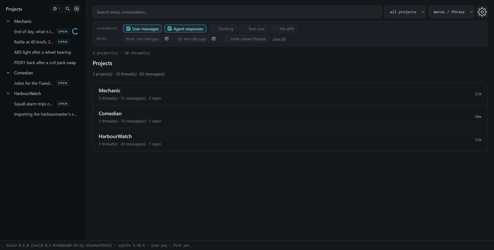
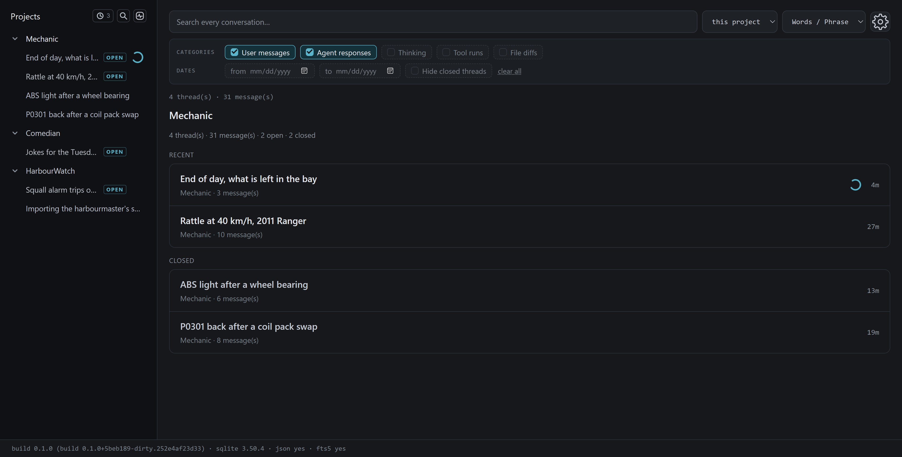
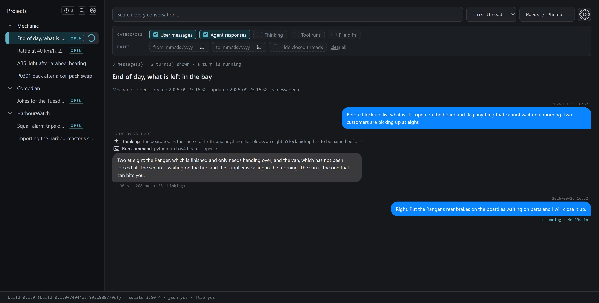
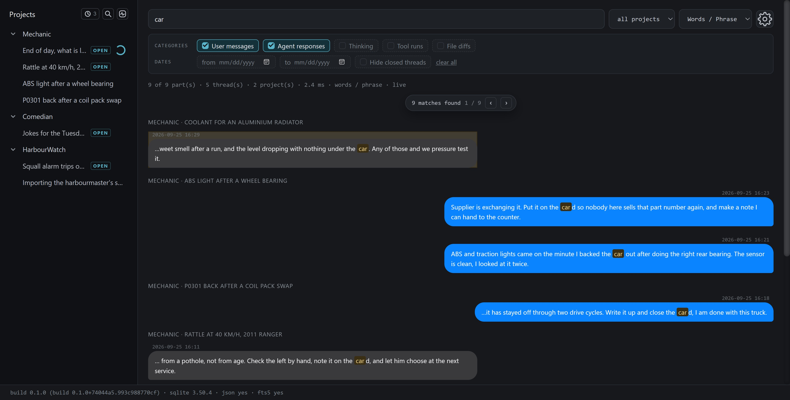
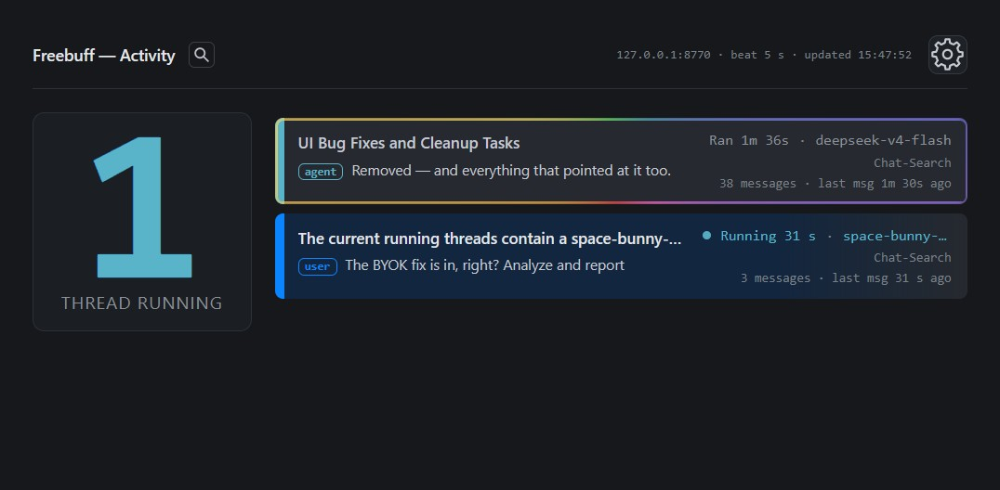

# Freebuff Dashboard

## Known bug found
`You can only have 10 projects maximum at the moment due to a SQLite maximum.  Fix is in the works.`
***
**Freebuff Dashboard** is a window into the conversations Freebuff Desktop keeps
on your machine. It finds your projects, opens any thread in full, and searches
across all of them at once — all locally, with nothing to sign in to, nothing to
install, and no way for it to change the files it reads.

Three screens carry it: **Projects**, every project it found and how long ago
each was last used; **Search**, where one query looks through all of them; and
**Activity**, a live board of the turns that are running right now.

> **It stays on your machine.** Everything runs at `127.0.0.1` — the address
> that means *this computer* — and your conversations are opened read-only, so
> the app cannot alter them even by accident. It never touches the file holding
> your Freebuff login, and it skips the sponsored cards that sit alongside
> conversations.
>
> If you elect to run this on `0.0.0.0` so your LAN can see the page, **you accept the risks**, 
> because there is currently no security on the HTTP server it runs.  All of your Freebuff
> threads will be available and searchable on your LAN.  
>
> **There is nothing to install.** Python 3.11 or newer is the entire
> requirement: no extra packages, no build step. The app checks what your Python
> and its SQLite can do as it starts, and adapts if either is older.

## The views

**Projects view** — the page you land on. Every project Freebuff knows about,
the most recently active first, each card carrying its thread and message counts
and how long ago it was last touched. Pick one and you are in that project's own
list of threads; the **Projects** heading and the magnifying glass beside it are
both the way back, and so is clearing the search box.



**Threads view** — one project's own list of threads. The ones touched most
recently come first and the closed ones follow, each with its message count and
how long ago it was last touched.



**Thread conversation view** — a whole conversation from start to finish. Your
messages and the agent's replies read as ordinary text, and everything else —
the thinking, the tool calls, the files a turn changed — folds away into its own
entry, so it is there when you want it and out of the way when you don't. A turn
still running says so, and the conversation fills in as it goes.



**Global search** — one box for every project. Type words or an exact phrase,
then narrow things down with the scopes, the categories (*user messages, agent
responses, thinking, tool runs, file changes*) and a date range. The results
come back grouped by project and thread, with your matches picked out where they
fell. Leave the box empty over everything and the project list is what you get;
leave it empty with the scope on a project or a thread and it browses that
instead.



  **Activity view** — the page at `/activity`, a live board of the turns in
flight. In the sidebar of the search page its control is a pulse inside a
rounded square and clicking it opens the board.

Each row shows the thread, its model and its newest message, and the row is
itself a link into that conversation. When a turn finishes, its row glows for a
moment, keeps up with the latest message, and then quietly slides away. The shot
below holds two rows: one thread still **running**, and one just **finished**,
waiting out `activity.close_seconds` (default 30s) before it goes.



## How it works

When you open the page, the server:

1. **Finds your projects** — it looks under the Freebuff Desktop settings folder
   and picks up each project it finds, labelled the way you would recognise it.
2. **Reads them without touching them** — every conversation database is opened
   read-only, so nothing the app does can turn into a change to your data.
3. **Shows whole conversations** — each thread in full: your messages and the
   agent's replies as readable text, with the thinking, the tool calls and the
   files a turn changed folded away beside them.
4. **Searches as you type** — words or an exact phrase, across the scopes and
   the five categories, with a date range and a *hide closed* switch; an empty
   query over everything is the project list, and an empty query inside a
   project or a thread browses that instead.
5. **Keeps itself current** — as Freebuff writes new messages, the page is
   updated on its own. There is no refresh button to press.
6. **Draws the activity board** — `/activity`, or `python fb-dashboard.py
   --activity` to open straight onto it, shows the turns in flight the same
   live way.

## Run

You need Python 3.11+ and nothing else.

**Windows:**

```bat
run.cmd
```

**Linux, macOS, WSL:**

```sh
./run.sh
```

Then open `http://127.0.0.1:8770` in your browser. The port comes from your
settings, and the address means *this computer* — the app answers there and
nowhere else.

### Try it without touching a real profile

```bat
run-mock.cmd        Windows
./run-mock.sh       Linux, macOS, WSL
```

The mock launcher builds a small pretend profile in the folder it runs from —
three made-up projects with open, closed and archived threads — and serves that
instead, on `http://127.0.0.1:8771`. None of your own conversations are read,
and nothing specific to this machine travels inside the archive.

### Directly

```sh
python fb-dashboard.py --help
python fb-dashboard.py --version
python fb-dashboard.py --port 8800 --no-index
```

A few options are worth knowing: `--host` and `--port` choose where it listens,
`--config` names a particular settings file, `--no-index` searches your
conversations directly and builds nothing in the background, `--activity` opens
on the activity board instead of the search page, and `--version` tells you
exactly which build you are running — worked out from the code itself rather
than declared by hand.

## Configuration

Copy `config.json.example` to `config.json` beside the launcher and it takes
over from there. Every setting is optional, and each one carries its own
explanation in the file. The app looks for `config.json` in the folder it is run
from first, then beside the launcher; `--config <path>` names a different file
instead. Whichever one it read is written into the run log, so a setting that
seems to be ignored is never a mystery.

The keys you are most likely to change:

- `server` — the host and port it listens on, whether a browser opens for you,
  and which page it opens on (`/activity` for the board).
- `data` — where your Freebuff profiles live (the app works this out for you by
  default), which projects to include or skip, and how often to check for new
  messages.
- `activity` — `close_seconds`: how long a finished turn stays on the board
  before its row disappears, in seconds (`30` by default; `0` clears it right
  away).
- `search` — the starting point for a new search: its mode, scope, categories,
  how many results to show, and how much of each to display.
- `ui` — the theme, and whether closed threads are hidden.

Today the search runs against your conversations directly. A faster pre-built
index is planned for later, and `--no-index` keeps the app off it meanwhile.

## Layout

A quick tour of what is in the folder:

```
fb-dashboard.py               the program you run: starts the server, reads your settings
dashboard/                    the application itself
├── app.py                    the web server, its routes, and the live update stream
├── board.py                  builds the activity board: the turns running right now
├── build_id.py               works out which build is running, from its contents
├── config.py                 loads your settings and finds your Freebuff profiles
├── corpus.py                 the queries that read your conversations
├── fleet.py                  finds your projects and opens them read-only
├── markdown.py               turns stored text into readable messages
├── reader.py                 assembles a thread into the conversation you see
├── search.py                 the search itself: filters, matching, snippets
├── watch.py                  watches for new messages and pushes them to the page
└── pages/                    the pages you actually look at: the search app
                              (index.html, app.css, app.js) and the board
                              (activity.html, activity.css, activity.js)
tools/
└── make_test_profile.py      builds the pretend profile the mock launcher uses
tests/                        the automatic checks that keep the app honest
├── run_tests.py              runs them all
├── fixture.py, harness.py, stamps.py, suites.py, testlog.py
│                             the shared plumbing the checks rely on
├── config/                   sample settings the checks run the app with
└── test_*.py                 the checks themselves
config.json.example           every setting, each with a note explaining it
run.cmd, run.sh               the friendly way in: start the server
run-mock.cmd, run-mock.sh     start it against a pretend profile instead
screenshots/                  the view shots above
```

## The guarantees

- **Your conversations cannot be changed.** Every conversation database is
  opened read-only, and a check hashes them all before and after a full session,
  failing if even one byte moves.
- **Your login is left alone.** The file holding your Freebuff credentials is
  never opened, and the sponsored cards that sit alongside conversations are
  never read or shown. Both are boundaries in the code, not settings to trust.
- **Only you can reach it.** The app listens on `127.0.0.1` — *this computer* —
  and refuses to answer the wider network. Starting it twice on the same port
  simply fails rather than quietly giving way.
- **It tells you what it found.** At startup it checks your Python, your SQLite,
  and what that SQLite can do, then reports the results, so it can fall back to
  something slower instead of quietly breaking.
